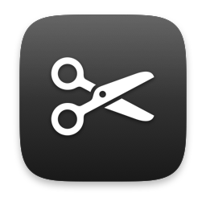

<div align="center">



# CmdX

**Windows-style cut & paste for macOS Finder.**

`⌘X` cuts. `⌘V` pastes. `⌫` deletes. The way you already expect them to.

[](https://www.apple.com/macos/)
-blue)
[](https://swift.org)
[](LICENSE)

</div>

---

## The problem

macOS *can* move files with the keyboard — but it hides it behind a shortcut almost nobody finds:

| | macOS default | With CmdX |
|---|---|---|
| Copy a file | `⌘C` → `⌘V` | `⌘C` → `⌘V` *(unchanged)* |
| **Move a file** | `⌘C` → **`⌘⌥V`** | **`⌘X` → `⌘V`** |
| **Delete a file** | **`⌘⌫`** | **`⌫`** |

If you've ever come from Windows and pressed `⌘X` in Finder expecting a cut, or tapped `⌫` expecting a file to disappear, this fixes both.

## What it does

CmdX lives in your menu bar, watches for `⌘X`, `⌘V` and `⌫` **only while Finder is frontmost**, and rewrites them into the commands Finder already understands — `⌘C` for cut, `⌘⌥V` ("Move Item Here") for paste, and `⌘⌫` for delete.

**Finder performs every file operation.** CmdX never touches a file itself. That means you keep:

- Finder's own progress bars and name-collision dialogs
- Correct handling of permissions and cross-volume moves
- **`⌘Z` to undo a move**, exactly as normal

### Context decides what the keys mean

| Where you are | `⌘X` does | `⌫` does |
|---|---|---|
| Finder file list (icon, list, column or gallery view) | Cuts **files** | Moves files to **Trash** |
| Renaming a file, or in the search box | Cuts **text** | **Backspace**, as always |
| Any app that isn't Finder | Nothing — untouched | Nothing — untouched |

`fn+⌫` always stays forward-delete. `⌘⌥V`, `⌘⇧V`, `⌘⌫`, `⌥⌫` and `⌘⌥⌫` are all left exactly as macOS defines them — including `⌘⌥⌫`, the permanent delete, which CmdX deliberately never touches.

### It won't surprise you

- **A cut expires when you copy something else.** Cut a file, then copy anything in any app, and the pending cut is silently dropped — a forgotten `⌘X` can never turn a later paste into an unexpected move.
- **`⌘X` on an empty selection does nothing.** No phantom cut left armed.
- **Holding a key acts once.** This matters most for `⌫`: Finder selects the next file after trashing one, so without this a held Delete would walk down a folder emptying it.
- **Delete means Trash, never permanent.** CmdX synthesizes `⌘⌫`, so deleted files land in the Trash and `⌘Z` brings them straight back. `⌘⌥⌫` — macOS's delete-with-no-undo — is something CmdX deliberately never touches, and there's a test whose only job is to keep it that way.
- **If anything goes wrong, your keystroke passes through untouched.** CmdX is built to fail toward stock macOS behaviour rather than swallow input.

### Take one feature, or both

The two behaviours are switched independently from the menu bar, so you're never forced into both:

```text
Cut and paste files      ⌘X / ⌘V     ▓▓○
Delete to Trash          ⌫           ▓▓○
Launch at login                      ▓▓○
```

Want Windows-style cut and paste but find a bare Delete key too risky? Turn Delete off and keep the rest. Your choice is saved and survives relaunch and login — a preference that quietly reset itself every morning would be worse than no preference at all.

The menu stays open while you flip switches, so setting up takes one visit rather than one per toggle.

The menu bar icon fills in ✂️ while a cut is pending, and dims when both features are off or CmdX lacks permission.

> **On the Delete key:** a bare `⌫` is much easier to hit by accident than `⌘X`. That's exactly why it goes to the Trash rather than deleting outright, why a held key only fires once, and why any failure in CmdX's focus detection results in *nothing being deleted* rather than the reverse.

---

## Install

### Option 1 — Download

1. Grab `CmdX.dmg` from the [latest release](https://github.com/nisarganag/CmdX/releases/latest).
2. Open it and drag **CmdX** to **Applications**.
3. **Important — the app is not notarized** (see [below](#a-note-on-signing)), so macOS will quarantine it and may say *"CmdX is damaged and can't be opened."* It isn't damaged. Clear the quarantine flag:

   ```bash
   xattr -dr com.apple.quarantine /Applications/CmdX.app
   ```

   Then open it normally. (Right-click → **Open** also works on some macOS versions.)
4. Launch CmdX and **grant Accessibility permission** when prompted.
5. Click the menu bar icon → enable **Launch at Login**.

### Option 2 — Build it yourself

Takes about a minute and sidesteps the quarantine issue entirely, since locally-built apps aren't quarantined. See [Building from source](#building-from-source).

---

## Permissions

CmdX needs **Accessibility** access (System Settings → Privacy & Security → Accessibility). This is not optional — macOS provides no other way for an app to intercept a keystroke before another app receives it.

Concretely, CmdX uses that access to:

- see `⌘X` / `⌘V` / `⌫` key events and decide whether to consume them
- ask Finder whether a text field currently has focus, so it knows whether you mean *cut this file* or *cut this text*
- send Finder the synthetic `⌘C` / `⌘⌥V` / `⌘⌫` that do the actual work

It does not log keystrokes, read your clipboard contents, or make network requests. [The source is right here](Sources/) — the entire decision logic is one small file, [`CutStateMachine.swift`](Sources/CmdXCore/CutStateMachine.swift).

---

## Building from source

**Requirements:** macOS 13+ and Xcode **Command Line Tools**. Full Xcode is *not* needed.

```bash
xcode-select --install     # if you don't have them already
```

Then:

```bash
git clone https://github.com/nisarganag/CmdX.git
cd CmdX
./build.sh
```

That produces both artifacts in `dist/`:

```text
dist/CmdX.app     universal binary (arm64 + x86_64), ad-hoc signed
dist/CmdX.dmg     disk image with an /Applications shortcut
```

Install and run it:

```bash
cp -R dist/CmdX.app /Applications/
open /Applications/CmdX.app
```

Grant Accessibility when prompted, and you're done.

> **Heads up:** `build.sh` starts with `rm -rf dist/`. If CmdX is currently running *from* `dist/`, quit it first (`pkill -x CmdX`) or you'll be deleting the app out from under itself.

### Running the tests

```bash
swift run CmdXCoreTests
```

74 assertions covering the full decision table — every gating rule, the cut/paste state transitions, stale-cut invalidation, key-repeat handling and key-release tracking.

There's no XCTest here on purpose: XCTest and swift-testing both ship with Xcode, and this project deliberately builds with Command Line Tools alone. The suite is a plain executable target with a small assertion harness that exits non-zero on failure, so it works in CI and in a bare terminal alike.

### Project layout

```text
Sources/
  CmdXCore/            pure decision logic — no AppKit, fully unit-tested
    CutStateMachine.swift    the entire interception policy lives here
    Types.swift              Key, Feature, Phase, Decision, CutState, Input
    ModifierGate.swift       which modifier combinations CmdX may touch
  CmdXCoreTests/       executable test target (74 assertions)
  CmdXApp/             the AppKit shell — deliberately thin, holds no policy
    EventTapService.swift    CGEventTap: creation, callback, recovery
    FocusInspector.swift     asks Finder what has keyboard focus
    FrontmostWatcher.swift   caches "is Finder frontmost"
    KeySynthesizer.swift     posts the synthetic ⌘C / ⌘⌥V / ⌘⌫
    PermissionMonitor.swift  Accessibility grant polling + recovery
    StatusItemController.swift  menu bar icon and menu
    ToggleMenuRow.swift      view-based menu row that stays open on click
    LoginItem.swift          SMAppService registration
    Preferences.swift        persists which features are switched on
Tools/
  makeicon.swift       renders the app icon from an SF Symbol — no binary assets
build.sh               build → bundle → sign → package
```

The split is the point: every non-trivial decision lives in `CmdXCore`, which has no dependency on AppKit and can be tested exhaustively without a running event tap. The app layer only gathers facts and carries out verdicts.

---

## Troubleshooting

### "Accessibility: Not Granted" — but System Settings shows it enabled

This is the confusing one, and it happens **after you rebuild CmdX**.

Because CmdX is ad-hoc signed, its identity to macOS *is the hash of its binary*. Rebuild it, and macOS correctly sees a different program wearing the same name. System Settings keeps showing the old entry, enabled — and **toggling it off and on does not help**, because that just flips a switch on a record that still points at the previous build.

Clear the record instead, then relaunch:

```bash
tccutil reset Accessibility com.nisarganag.cmdx
open /Applications/CmdX.app
```

Grant it when prompted. You only hit this when rebuilding — install once and it stays granted.

### The menu says "Granted — tap not running"

CmdX has permission but couldn't install its event tap. It retries automatically every 2 seconds, so this usually clears itself. If it persists, quit and relaunch.

### `⌘X` or `⌫` does nothing in Finder

Open the menu and check that the relevant feature is ticked — they're switched separately, so one can be off while the other works. If the icon is dimmed, both are off or Accessibility isn't actually granted (see above).

### macOS says the app is damaged

It isn't — that's Gatekeeper quarantining an unnotarized download. See [Install](#option-1--download).

---

## A note on signing

CmdX is **ad-hoc signed and not notarized**, because notarization requires a paid Apple Developer account. Two practical consequences:

1. Downloading the `.dmg` triggers Gatekeeper. The `xattr` command above clears it.
2. Rebuilding invalidates the Accessibility grant (see [Troubleshooting](#troubleshooting)).

Neither affects a locally-built copy that you install once and leave alone.

If you'd rather not run a keyboard-intercepting app you can't verify — entirely reasonable — build it from source and read [`CutStateMachine.swift`](Sources/CmdXCore/CutStateMachine.swift) first. It's under 100 lines and it's where every decision is made.

---

## Known limitations

- **Finder only.** Third-party file managers and Open/Save panels are untouched by design.
- **A cut doesn't survive a copy.** That's deliberate — see [It won't surprise you](#it-wont-surprise-you).
- **Requires Accessibility permission.** There is no way around this for keystroke interception on macOS.

---

## License

[MIT](LICENSE) — do what you like with it.

---

<div align="center">

Created by **Nisarga** with ❤️

</div>
